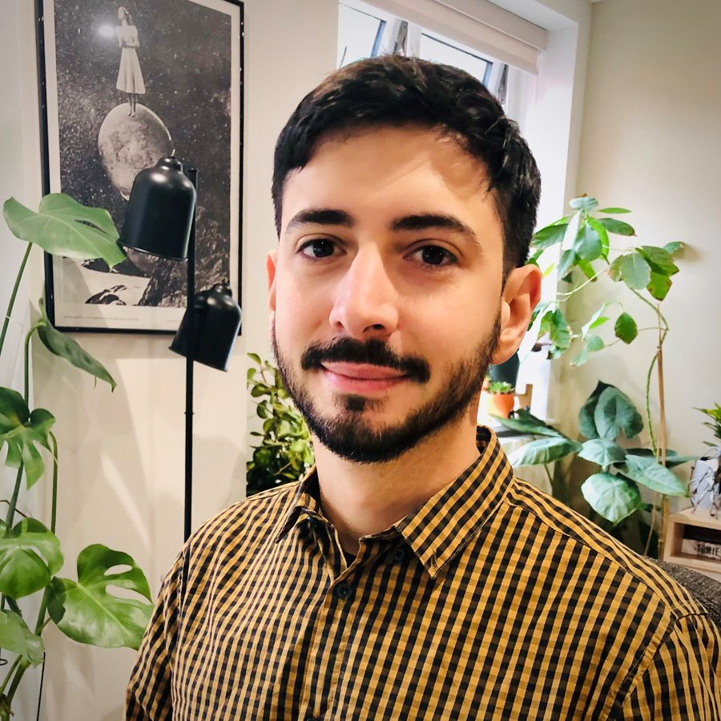

::: {.home-hero}
::: {.home-photo-panel}

{.home-photo fig-alt="Portrait of Iván Weigandi"}

Buenas!

:::

::: {.home-content}

::: {.lang-en}
I am an Argentinian economist interested in international and macro-financial analysis, credit risk, and policy research. I am currently a Research Fellow in Macroeconomics, Financing, and Global Shocks within the International Economic Development Group at [ODI Global](https://odi.org/en/profile/ivan-weigandi/).

I am part of the Local Currency for Development group, where I have participated in projects such as ["Enhancing MDB Capacity through Local Currency Lending"](https://business.leeds.ac.uk/dir-record/research-projects/2292/enhancing-mdb-capacity-through-local-currency-lending) and ["Currency Risk-Sharing Scheme for Scaling up Local-Currency Climate Finance in Uganda"](https://business.leeds.ac.uk/dir-record/research-projects/2516/currency-risk-sharing-facility-for-scaling-up-local-currency-climate-finance-in-uganda), through research roles at the University of Leeds and City St George's, University of London.

Previously, I worked as a Credit Analyst at Moody's Local Argentina (2019–2022), covering banks, structured finance transactions, and insurance companies. Before that, I was an analyst in the Research and Statistics Department at Argentina's National Insurance Superintendency (2013–2019). I also have several years of experience as an independent economic consultant. I am also a coordinator in the YSI Financial Stability Working Group.
:::
::: {.lang-es}
Soy un economista argentino interesado en macrofinanzas internacionales y macroeconomía, riesgo crediticio y políticas públicas. Actualmente soy Investigador en Macroeconomía, Financiamiento y Shocks Globales dentro del Grupo de Desarrollo Económico Internacional en [ODI Global](https://odi.org/en/profile/ivan-weigandi/).

Formo parte del grupo Local Currency for Development, donde he participado en proyectos como ["Enhancing MDB Capacity through Local Currency Lending"](https://business.leeds.ac.uk/dir-record/research-projects/2292/enhancing-mdb-capacity-through-local-currency-lending) y ["Currency Risk-Sharing Scheme for Scaling up Local-Currency Climate Finance in Uganda"](https://business.leeds.ac.uk/dir-record/research-projects/2516/currency-risk-sharing-facility-for-scaling-up-local-currency-climate-finance-in-uganda), a través de roles de investigación en la Universidad de Leeds y City St George's, Universidad de Londres.

Anteriormente, trabajé como Analista de Crédito en Moody's Local Argentina (2019–2022), cubriendo bancos, transacciones de finanzas estructuradas y compañías de seguros. Antes de eso, fui analista en la gerencia de Estudios y Estadísticas de la Superintendencia de Seguros de la Nación (2013–2019). También cuento con varios años de experiencia como consultor económico independiente, y soy coordinador en el Grupo de Trabajo de Estabilidad Financiera de YSI.
:::

## Education

::: {.lang-en}
[**University of Leeds**](https://business.leeds.ac.uk/pgr/1367/ivan-weigandi){.edu-link} - UK  
PhD in Economics - 2026  

**Universidad Nacional de General San Martín** - Argentina   
Master's in Economic Development (Macroeconomics & Development Financing) - 2021

**Universidad de Buenos Aires** - Argentina  
B.A. in Economics - 2018
:::
::: {.lang-es}
[**Universidad de Leeds**](https://business.leeds.ac.uk/pgr/1367/ivan-weigandi){.edu-link} - Reino Unido  
Doctorado en Economía - 2026  

**Universidad Nacional de General San Martín** - Argentina   
Maestría en Desarrollo Económico (Macroeconomía y Financiamiento del Desarrollo) - 2021

**Universidad de Buenos Aires** - Argentina  
Licenciatura en Economía - 2018
:::

:::
:::
