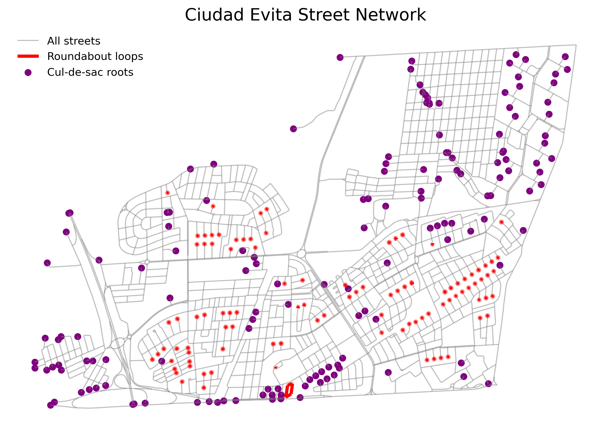

---
title: "¿Cuantas rotondas sin salida hay en Ciudad Evita?"
author: "Iván Weigandi"
date: "2026-11-15"
label: "Blog"
categories: [Ciudad Evita, Data visualization, Urban planning]
image: "map.png"
draft: true

---


```{python}
#| eval: false
import osmnx as ox
import networkx as nx
import geopandas as gpd
import matplotlib.pyplot as plt
from shapely.affinity import rotate
from shapely.geometry import Point
from shapely.ops import unary_union

# 1. Fetch street network
place = "Ciudad Evita, La Matanza, Argentina"
G_uns = ox.graph_from_place(place, network_type="drive", simplify=False)
G_nd = nx.Graph(G_uns)

# 2. Detect roundabouts (cycles with 1 external connection)
cycles = nx.cycle_basis(G_nd)
dead_cycles = [
    c for c in cycles 
    if len({nb for n in c for nb in G_nd.neighbors(n) if nb not in c}) == 1
]

# 3. Detect cul-de-sacs (dead-ends)
streets_per_node = ox.stats.count_streets_per_node(G_uns)
cul_nodes = {n for n, cnt in streets_per_node.items() if cnt == 1}

# 4. Extract geometries for plotting
edges_uns = ox.graph_to_gdfs(G_uns, nodes=False, edges=True).reset_index()
edges_uns['uv'] = edges_uns.apply(lambda r: tuple(sorted((r['u'], r['v']))), axis=1)

# Extract loops
loop_geoms = [
    edges_uns.loc[edges_uns['uv'] == tuple(sorted((u, v))), 'geometry'].iloc[0]
    for cyc in dead_cycles for u, v in zip(cyc, cyc[1:] + [cyc[0]])
]
cycle_gs = gpd.GeoSeries(loop_geoms, crs="EPSG:4326")

# Extract dead-end points
pts = gpd.GeoSeries(
    [Point(G_uns.nodes[n]['x'], G_uns.nodes[n]['y']) for n in cul_nodes], 
    crs="EPSG:4326"
)

# Rotate geometries for a better visual angle
rotation_angle = 220
area = ox.geocode_to_gdf(place)
ctr = area.geometry.centroid.iloc[0]

all_edges = edges_uns.drop_duplicates(subset='uv').set_geometry('geometry')
all_rot = all_edges.geometry.apply(lambda g: rotate(g, rotation_angle, origin=(ctr.x, ctr.y)))
cycle_rot = cycle_gs.apply(lambda g: rotate(g, rotation_angle, origin=(ctr.x, ctr.y)))
pts_rot = pts.apply(lambda p: rotate(p, rotation_angle, origin=(ctr.x, ctr.y)))

# 5. Plot the chart
fig, ax = plt.subplots(figsize=(10, 10))
all_rot.plot(ax=ax, linewidth=1, color='gray', alpha=0.5, label='Todas las calles')
cycle_rot.plot(ax=ax, linewidth=3, color='red', label='Calle sin salida')
pts_rot.plot(ax=ax, markersize=30, color='purple', label='Rotondas cul-de-sac')

ax.set_aspect('equal')
ax.axis('off')
ax.legend(loc='upper left', frameon=False)
ax.set_title("Ciudad Evita Street Network", fontsize=16)
plt.show()
```




Fua banda